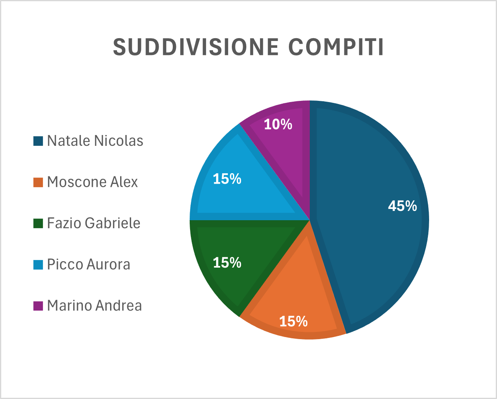

# Suddivisione dei lavori

### Natale Nicolas

Nicolas si è occupato di programmare il file newReport.php, che legge i dati contenuti all'interno del file .csv, interpretarli e successivamente caricarli nel database dedicato al progetto. Finite queste operazioni, sposta il file letto in una cartella d'archivio dove quindi sarà possibile trovare tutti quanti i file letti e caricati.

Autovalutativamente, la percentuale di lavoro svolto è del 45%.

### Moscone Alex

Alex si è occupato delle funzioni di ricerca nel database e di importazione file che vengono usati nell'interfaccia utente nel file reports.php, rispettivamente per visualizzare i filtri con un determinato codice e per richiamare il file newReport.php e quindi caricare sul database un nuovo report.

Autovalutativamente, la percentuale di lavoro svolto è del 15%.

### Fazio Gabriele

Gabriele si è occupato della struttura html del file reports.php, quindi anche della stampa in una tabella dei dati ricavati dal database. Ha inoltre aiutato i compagni Moscone Alex e Picco Aurora a ideare le loro parti di progetto, ma solo a livello concettuale e non a livello pratico o di programmazione.

Autovalutativamente, la percentuale di lavoro svolto è del 15%.

### Picco Aurora

Aurora si è occupata di tutta la parte grafica front end del sito e quindi del file style.css. Ha gestito quindi la responsività del sito e il suo aspetto estetico, per renderlo user friendly e piacevole alla vista.

Autovalutativamente, la percentuale di lavoro svolto è del 15%.

### Marino Andrea

Andrea si è occupato della parte di progetto precedente alla sua realizzazione, occupandosi di dargli una struttura concettuale tramite UML e diagrammi di flusso e coordinando le discussioni di brainstorming iniziali.

Autovalutativamente, la percentuale di lavoro svolto è del 10%.

---

